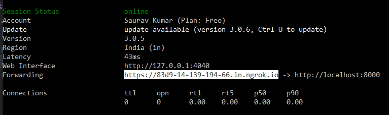

# MATHS-API

## Setup
1. Install anaconda.
2. Pull this repo.
3. Move to the folder of this repo.
3. Open the terminal in that folder and follow:
   ```
   conda env create -f Requirements.yml
   ```
   ```
   conda activate samsung
   ```
   ```
   python app.py
   ```
4. Server will be up at port 8000.

<br/>

## Use of ngrok to make localhost publicly accessible

1. Follow this [link](https://ngrok.com/download) to download and install ngrok.
2. Sign up to get a token.
3. Move to the folder containing ngrok.exe file.
4. Open terminal and add your token to ngrok.exe using following command:
    ```
    ngrok config add-authtoken <token>
    ```
    Replace \<token> with your token.
5. Start the tunnel.
    ```
    ngrok.exe http 8000
    ```
6. Copy the generated public
    <p align="center">
        
    </p>
    Use this in your android app.

<br/>
<br/>

## <b>All set now. Move to android app to start processing request.</b>